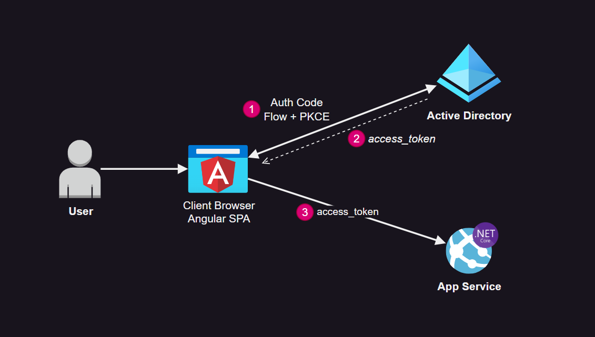

# Angular SPA + Web API authentication on Azure

Demonstration of an Angular app authentication with OAuth Auth Code Flow on Azure AD, with a backend hosted on App Services.



## Infrastructure

Create an app registration and a user:

```sh
az ad app create --sign-in-audience AzureADMyOrg --display-name "app-spa-webapi"
az ad sp create --id <application_idd>
az ad user create --display-name myuser --password password --user-principal-name myuser@contoso.com
```

To the app registration:
- Add SPA platform (do not select token generation) and set `http://localhost:4200` as the redirect URI 
- Make sure you also set the Application ID URI, like in `api://<application_id>`
- Create a scope named `api://<application_id>/user_impersonation`

Create the infrastructure:

```sh
az group create -n rgapp -l eastus
az appservice plan create -g rgapp -n planapp --is-linux --sku B1
az webapp create -g rgapp -p planapp -n appdotnetwebapi789 -r "DOTNETCORE:7.0" --https-only
az webapp config set -g rgapp -n appdotnetwebapi789 --always-on true
```

Add the required app settings (environment variables):

```sh
az webapp config appsettings set -g rgapp -n appdotnetwebapi789 --settings \
        AzureAd__Domain="<DOMAIN>" \
        AzureAd__ClientId="<CLIENT_ID>" \
        AzureAd__TenantId="<TENANT_ID>" \
        WEBSITE_RUN_FROM_PACKAGE=1
```

Set up CORS:

```sh
az webapp cors add -g rgapp -n appdotnetwebapi789 --allowed-origins "http://localhost:4200"
```

Restart the app:

```sh
az webapp restart -g rgapp -n appdotnetwebapi789
```

## Deploy the Application with App Authentication

Enter the application directory:

```sh
cd api
```

Build and deploy the webapi to App Services:

```sh
bash build.sh
az webapp deployment source config-zip -g rgapp -n appdotnetwebapi789 --src ./bin/api.zip
```

Test it:

```sh
curl https://appdotnetwebapi789.azurewebsites.net/api/dogs
```

Now enter `cd angular` into the SPA. Create the envs:

```
touch src/environments/environment.development.ts
touch src/environments/environment.ts
```

Add the environments:

```
export const environment = {
  production: true,
  appServiceEndpoint: "https://<app_name>.azurewebsites.net",
  applicationId: "<application_id>",
  tenantId: "<tenant_id>",
  redirectUri: "http://localhost:4200"
};
```

Start the application:

```sh
ng serve
```

Access the web application and login: `http://localhost:4200`

To access a protected route in the Web API: `http://localhost:4200/api`

## Local Development

Enter `cd api` directory and create `.env` file.

```sh
ASPNETCORE_ENVIRONMENT="Development"
AzureAd__Domain= "..."
AzureAd__ClientId="..."
AzureAd__TenantId="..."
```

## References

```
https://www.youtube.com/watch?v=AvNc1p2HywI
https://rakhesh.com/azure/authenticating-against-azure-functions-using-azure-ad/
https://learn.microsoft.com/en-us/azure/app-service/configure-authentication-customize-sign-in-out#client-directed-sign-in
https://jannehansen.com/call-aad-functions-from-spa/
https://www.youtube.com/watch?v=LyDgQx2asMU
https://stackoverflow.com/questions/67232719/easyauth-with-a-spa-and-azurefunction-on-different-hosts
https://github.com/AzureAD/microsoft-identity-web/issues/1806
https://blog.maximerouiller.com/post/using-easyauth-appservice-authentication-with-aspnet-core/
https://learn.microsoft.com/en-us/azure/app-service/tutorial-connect-app-app-graph-javascript?pivots=platform-linux
https://learn.microsoft.com/en-us/azure/active-directory/develop/scenario-spa-overview
https://learn.microsoft.com/en-us/azure/active-directory/develop/tutorial-v2-angular-auth-code
https://github.com/Azure-Samples/ms-identity-javascript-angular-tutorial/tree/main/3-Authorization-II/1-call-api
```
